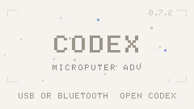
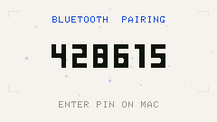
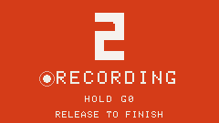

# Codex Microputer ADV

| 1. Ready | 2. Pair | 3. Control | 4. Speak |
| --- | --- | --- | --- |
|  |  |  |  |

<p align="center">
  <video src="https://github.com/user-attachments/assets/ce767565-add0-4f31-b462-34a8dcb9e293" poster="screenshots/demo_poster.jpg" controls muted loop playsinline width="100%"></video>
</p>

Codex Microputer ADV turns an M5Stack Cardputer ADV into a native six-channel
hardware controller for the Codex desktop app. It speaks the Codex Micro HID
protocol directly over USB or Bluetooth Low Energy. No bridge, daemon, API key,
Wi-Fi connection, or background script is required.

> This is an independent community project. It is not affiliated with or
> endorsed by OpenAI or M5Stack. Codex and Codex Micro are trademarks of their
> respective owners.

## What it does

- Mirrors the six task slots exposed by Codex Micro.
- Optionally mirrors the same six slots and status takeovers on one M5Stack
  Puzzle Unit 8x8 RGB matrix.
- Shows running, waiting, completed-unread, completed-viewed, error, and idle
  states as a full-screen six-column instrument panel.
- Opens a task immediately with keys `1` through `6`.
- Reflects task selection made in Codex back onto the Cardputer.
- Plays debounced, status-specific animations and sound cues.
- Sends the native Codex Micro encoder, analog-stick, Approve, Reject,
  interrupt, send, and configurable action commands.
- Activates Codex voice input for the selected task while the microphone key is
  held. Audio is captured by the computer running Codex; the Cardputer does not
  stream microphone audio.
- Uses USB HID whenever available and falls back to the selected BLE host when
  USB is disconnected.
- Stores three independent BLE host profiles and reconnects automatically.
- Mirrors Codex Micro brightness and auto-dim settings, reports battery state,
  and keeps local sound preferences on the device.
- Runs as an application inside [M5Apps](https://github.com/d4rkmen/M5Apps),
  preserving the launcher and other installed Cardputer tools.

The primary and release-tested target is **M5Stack Cardputer ADV**. The source
contains a scanner for the original Cardputer keyboard, but that hardware is
not part of the release qualification matrix.

## What it does not do

- It does not use the OpenAI API and does not contain or request API keys.
- It does not replace Codex or run agents on the Cardputer.
- It does not connect over Wi-Fi.
- It does not transmit audio from the Cardputer microphone.
- It cannot show task titles, timestamps, token usage, progress, or more than
  six tasks because the native Micro protocol does not publish that data.
- It cannot discover arbitrary remote chats that Codex has not assigned to one
  of its six Micro slots.
- Only one BLE host profile is active at a time. USB takes priority while
  connected.
- Windows and Linux host behavior is not currently release-tested.

The Codex Micro protocol is not a public stable API. A future Codex desktop
update may require corresponding firmware changes.

## Requirements

- [M5Stack Cardputer ADV](https://docs.m5stack.com/en/core/Cardputer-Adv) with
  an 8 MB flash chip.
- Optional: one [M5Stack Puzzle Unit](https://docs.m5stack.com/en/unit/Unit-Puzzle)
  and its standard Grove cable.
- A microSD card for the first M5Apps installation, or a USB cable for the
  development installer.
- [M5Apps](https://github.com/d4rkmen/M5Apps) installed on the device.
- A current Codex-capable desktop app with Codex Micro support.
- macOS 14 or later for the currently tested host path.
- For building: Git, Python 3, CMake/Ninja prerequisites required by ESP-IDF,
  and enough disk space for the ESP-IDF toolchain.

## Install a release build

1. Install and boot M5Apps on the Cardputer ADV.
2. Download `Codex.bin` from this repository's latest GitHub release.
3. Copy `Codex.bin` to a FAT32 or exFAT microSD card.
4. In M5Apps, open **Installer → SD card → Codex.bin**.
5. Launch **Codex** from the M5Apps launcher.
6. On the computer, open Codex and connect the detected `Codex Micro ADV`
   device over USB or Bluetooth.

Do not flash `Codex.bin` at address `0x0`: it is an application image, not a
complete device image. M5Apps owns the bootloader and partition table.

## Build from source

The setup script installs pinned, project-local dependencies under `.deps/`:
ESP-IDF 5.5.3 and the tested M5Stack Cardputer demo revision. It also applies
the small ESP-IDF HID compatibility patch tracked in `patches/`.

```bash
git clone <repository-url>
cd codex-microputer-adv
./tools/setup.sh
./tools/test.sh
./tools/build.sh
```

The M5Apps application image is written to `dist/Codex.bin`.

If ESP-IDF and the M5Stack dependencies are already installed elsewhere, set
`IDF_PATH`, `IDF_TOOLS_PATH`, and `M5CARDPUTER_DEMO_PATH` before sourcing
`tools/env.sh`.

## Install over USB during development

After M5Apps has created the `Codex` app partition once:

```bash
source tools/env.sh
./tools/build.sh
./tools/install.py
```

The installer auto-detects `/dev/cu.usbmodem*`, verifies that the staged image
matches the current build, writes only the existing `Codex` OTA partition,
checks the flash digest, selects it through standard M5Apps OTA metadata, and
launches it. Creating or resizing a partition requires the explicit
`--create-partition` flag because that operation edits the partition table.

## Controls

| Cardputer control | Native Codex Micro action |
|---|---|
| `1` … `6` | Select and open task slot 1 … 6 |
| `[` / `]` | Encoder counter-clockwise / clockwise |
| `\` | Encoder click |
| `;` / `.` / `,` / `/` | Analog stick up / down / left / right |
| `Y` | Approve (`ACT07` by default) |
| `U` | Reject (`ACT08` by default) |
| `A` | Combined voice action (`ACT10_ACT11`) |
| Hold `G0` | Push-to-talk for the selected task |
| Enter or Space | Send prepared composer message (`ACT12`) |
| Delete | Interrupt current turn |
| `-` | Mute or restore local sound |
| Tab | User settings |
| Option+Tab | Developer and diagnostics menu |
| Backtick | Back |

Action slots remain configurable in Codex. Long presses, releases, and native
encoder gestures are sent as physical HID edges rather than guessed locally.
Any key pressed while the display is asleep only wakes it; that first press is
not forwarded.

## Interface and settings

The display is a six-column, one-pixel-separated task deck. Blue means running,
orange means action is required, green means completed but unread, light grey
means completed and viewed, and pale grey means idle. A bottom rail marks the
selected task. A status change expands its slot across the display, holds the
state briefly, then returns without blocking input.

User settings include volume, startup sound, startup composition, BLE host
profile, and return to M5Apps. The default startup composition is `CLOUD` and
the default 60% volume reproduces the original hardware output level 150.

Option+Tab exposes status animation tests, ten startup compositions, a
-300..+300 ms status-audio offset in 25 ms steps, debounce choices, BLE/USB
controls, and preview screens. These tools use the production rendering and
audio paths but do not mutate a Codex task.

### Puzzle Unit task mirror

Connect the Cardputer ADV Grove port to the Puzzle Unit's **INPUT** socket with
the standard Grove cable. The default build sends the WS2812E data stream on
GPIO2. One matrix is supported; the Puzzle output socket is not used.

The 8x8 matrix lays slots 1-3 across the top and slots 4-6 across the bottom.
The one-LED outer frame carries the selected task's status colour and breathes
with it; inside, the remaining 6x6 field divides exactly into six equal 2x3
blocks with no dark gutters. Unassigned tasks are off. Running is blue, input-needed is orange,
completed-unread is green, completed-viewed is light grey, idle is a dim
neutral, and error is a red mark on black. The selected block breathes gently.
When the LCD plays a status takeover, the corresponding block expands to the
whole matrix and shows its centred 4x6 slot number on the same timeline. While the LCD
is in a menu, queued status events wait and the Puzzle continues to show the
task deck.

The matrix follows the effective, debounced Codex backlight level. Sleep,
backlight zero, or loss of the Codex session clears all 64 LEDs. Hardware
updates are capped at 30 FPS and identical frames are not retransmitted. The
default and hard renderer ceiling are 10% of full WS2812 brightness, matching
M5Stack's continuous-use recommendation.

Build-time settings live under **Codex Microputer hardware** in `menuconfig`:
`CONFIG_CODEX_PUZZLE_ENABLED`, `CONFIG_CODEX_PUZZLE_GPIO`, the 0/90/180/270
rotation choice, and `CONFIG_CODEX_PUZZLE_MAX_BRIGHTNESS_PERCENT`. The feature
is enabled by default in this fork. Rotation changes only the logical-to-wire
mapping and does not affect the renderer or Codex protocol.

## Connection behavior

USB HID is preferred whenever mounted. Disconnecting USB returns control to the
selected BLE profile. Each of the three BLE profiles has independent bonding
state. Pairing uses the code shown on the Cardputer screen; reconnection does
not require pairing again. Signal strength is monitored and transmit power is
adjusted dynamically.

The firmware stores settings and BLE bonds in its own `codex_ccp2` namespace in
M5Apps' shared `apps_nvs` partition. It never erases the partition. It contains
no credentials for Codex, GitHub, OpenAI, Wi-Fi, or any other service.

## Verification

Run the host regression suite before every build:

```bash
./tools/audit_public_tree.py
./tools/test.sh
```

It covers the status reducer, announcement queue, animation continuity, HID
framing, session synchronization, adaptive BLE power, keyboard mapping, display
fade, and source-level safety contracts. GitHub Actions runs the suite with
sanitizers and also performs a clean, pinned ESP-IDF firmware build.
The public-tree audit rejects common credential formats, private keys,
machine-local home paths, hardware addresses, and ignored artifact directories.

After flashing on macOS:

```bash
source tools/env.sh
./tools/verify_codex_connection.py
```

The verifier includes the previous three minutes by default, so it can be run
after the short initialization exchange has completed. It watches the local Codex desktop log for successful
`v.oai.rgbcfg`, `v.oai.thstatus`, and `device.status` exchanges and fails on
control-plane initialization errors. `tools/devlink.py --demo` can exercise the
display and audio without a Codex session.

## Repository layout

- `main/` — firmware, transports, protocol, UI, audio, storage, and input.
- `tests/` — host-side regression tests compiled with warnings as errors.
- `tools/` — reproducible setup, build, install, diagnostics, and asset tools.
- `patches/` — pinned ESP-IDF compatibility patch.
- `docs/` — interaction details.
- `DESIGN.md` and `PRODUCT.md` — product and visual contracts.
- `SCENARIOS.ru.md` — concise Russian action/result acceptance scenarios.

### Device screenshots

The firmware captures stable frames through the production display renderer,
including a representative six-task deck. Connect the Cardputer over USB and
capture one screen or the complete gallery:

```bash
python3 tools/screenshot.py --scene deck --output screenshot.png
python3 tools/screenshot.py --scene live --output current-screen.png
python3 tools/screenshot.py --scene all --output screenshots
```

Available scenes are `live`, `splash`, `pairing`, `deck`, `recording`, `composer`,
`settings`, `debug`, `chime`, `status`, and `signal`. Screenshot traffic is USB-only and does not congest
the native Codex BLE session. Demo task state exists only for the duration of
the render and never replaces the live task list.

The complete captured gallery is stored in [`screenshots/`](screenshots/).

## License

Project source is available under the [Apache License 2.0](LICENSE). Embedded fonts
retain their SIL Open Font License notices in `assets/fonts/`.
